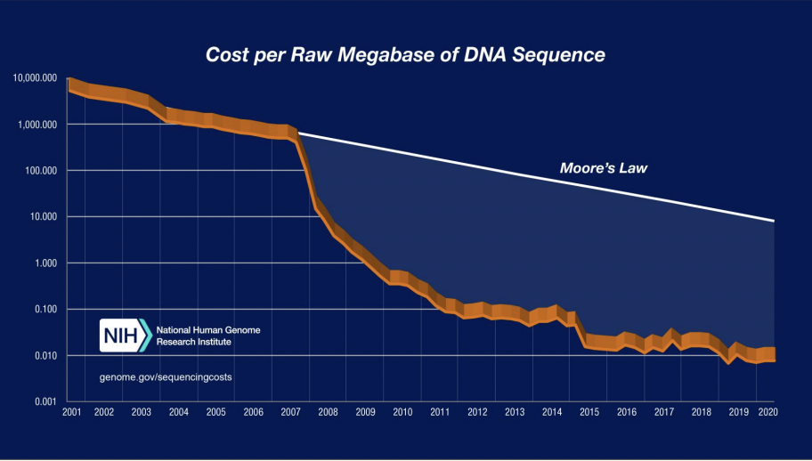

# My-Guide-To-Learning-from-Large-Scale-Biological-Data
Documenting my journey on learning from large-scale biological data

**II. Biological Data**

"Nothing in biology makes sense except in the light of evolution" - Theodosius Dobzhansky
 - Pessimistic View: Everyting we observe is an edge case because data point is the result of a random process, there is no design
 - Optimistics View: Everything we observe, in terms of biological data, is the output of this one simple process: evolution

**III. DNA Sequencing Outpaces Moore's Law**

- Moore's Law: th principle that the speed and capability of computers can be expected to double every two years, as a result of increases in the number of transistors a microchip can contain
- Modern biological data is LARGE

- We can learn from this large and complex ~large-scale biological data through modern algorithms and machine learning tools and turn it into biologial insights
- From this, we can familiar with the most common types of large-scale data encouraged in biology, the analyses to be performed on these data types, understand the potential pitfalls of each of these approaches, and apply these methods to new data with a critical eye

**Session 1**: Pitfalls of Machine Learning in Genomics
**Session 2**: The "Art" of Single-cell Genomics